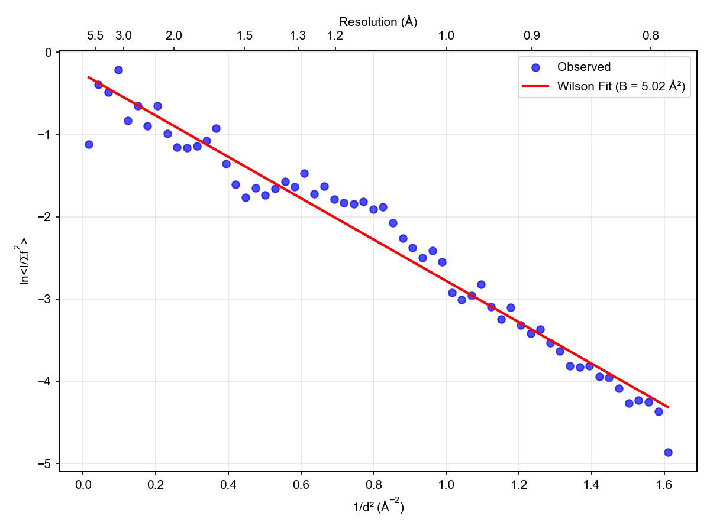
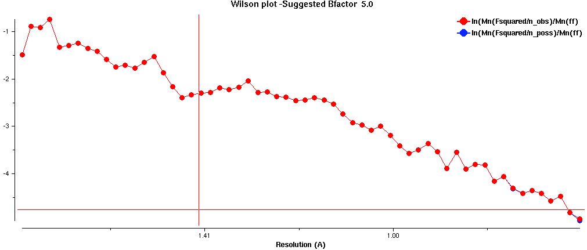

[](https://opensource.org/licenses/MIT)


# Wilson plots

## Background
A.J.C. Wilson in 1949 developed a plot for analyzing X-ray diffraction data from crystals. 
The plot displays the natural logarithm of the average intensity of reflections (ln⟨I⟩) against the square of the reciprocal resolution (1/d²).
`d` is the Miller plane spacing in Angstroms.

Wilson's key insight was that for a random distribution of atoms, the relationship between average intensity and resolution follows:


$$\ln \left(\langle I) /\left(\Sigma f^2\right\rangle\right)=\ln (k)-2 B\left(\sin ^2 \theta / \lambda^2\right)$$

Where:

- k is a scale factor
- B is the overall temperature factor (B-factor)
- sin²θ/λ² equals 1/4d²

This creates a linear relationship where:

- The slope equals -2B (allowing B-factor determination)
- The y-intercept provides the scale factor

The plot estimates the overall isotropic temperature factor for a crystal structure.
Aberations in the plot can be used to detect problems in the data, like radiation damage, anisotropy, or no more signal.
Bulk solvent effects in crystals of biomolecules cause deviations from linearity.
Spikes in the plot are due to ice rings.
Deviations at high resolution can indicate radiation damage or anisotropy.
Overall linearity may indicate twinning, modulation, or other issues.

## The problem and the solution

If you are a protein crystallographer, you probably saw the recent post on CCP4bb about how we should be looking at Wilson plots before we fret about the $I/{\sigma}$ in the high-resolution shell.
This is excellent advice, but viewing the Wilson plot can be a pain when processing dozens of diffraction data sets after a bout of data collection with synchrotron radiation.

Below is an example of my homemade Wilson plot with a Python script and the CCP4 truncate log file.
It is easily invoked with a bash function, as given below.
The plot is of a data set where the high-resolution limit should be truncated, even though the $I/{\sigma}$ was 1.5 in the highest-resolution shell.

<p align="center"></p>

Note that the outlier does not stand out in the snapshot of the Wilson plot made by loggraph.

<p align="center"></p>


## Python3 version

The Python script is called wilsonplot3.py (uses Python3). 

```bash
python3 ./wilsonplot3.py ./3173d_1_xds/3173d_1_truncate.log 3173d-wilson.png && preview 3173d-wilson.png
```

On your Mac, you can use a bash function that takes two arguments: the image file stem and the run number (e.g. wilson 3091 1). 

```bash
wilson () {
echo "This script calls wilsonplot.py to generate a Wilson Plot using the data in the truncate.log file."
echo "It assumes that the output files are stored by run number following the convention used by autoxds."
echo "This function has to be evoked from the directory with the images."
echo "This script takes the file stem of a image filename and the run number as two arguments in that order."
echo "This is faster than navigating to the folder and searching the log file for the summary table with vim."
if [ $# -lt 2 ]; then
   echo 1>&2 "$0: not enough arguments"
   echo "Usage: wilson 3091 1"
   return 2
elif [ $# -gt 2 ]; then
   echo 1>&2 "$0: too many arguments"
   echo "Usage: wilson 3091 1"
   return 2
fi
python ~/Scripts/SMBscripts/wilsonplot.py ./$1_$2_xds/$1_$2_truncate.log $1_$2-WilsonPlot.png && open -a preview $1_$2-WilsonPlot.png
}
```


## Python2 version

This is the customized bash function for SMB server at SSRL.
It uses Python2 from inside cctbx, which has the required dependencies.
You have to enter 'bash' to switch from tcsh.
Then you source your ~/.bashFunctions file to load the bash functions: `source .bashFunctions`.
Now, you can enter `wilson <filestem> <run number>` from the folder containing the image files.
On the SMB server, the plot opens in Gimp.


```bash
function wilson {
echo "This script calls wilsonplot.py to generate a Wilson plot using the data in the truncate.log file."
echo "It assumes that the output files are stored by run number following the convention used by autoxds."
echo "It has to be evoked from the directory with the images."
echo "This script takes the file stem of an image filename and the run number as two arguments in that order."
echo "This is faster than navigating to the folder and searching the log file for the summary table with vim."
if [ $# -lt 2 ]; then
   echo 1>&2 "$0: not enough arguments"
   echo "Usage: wilson 3091 1"
   return 2
elif [ $# -gt 2 ]; then
   echo 1>&2 "$0: too many arguments"
   echo "Usage: wilson 3091 1"
   return 2
fi
cctbx.python ~/scripts/wilsonplot2.py ./$1_$2_xds/$1_$2_truncate.log $1_$2-wilsonplot.png && open $1_$2-wilsonplot.png
}
```

## AI disclosure: 

Claude 3.7 Sonnet Thinking was used in many iterative cycles of code generation and testing.


|Version      | Changes                                                                                                 |        Date          |
|:-----------|:---------------------------------------------------------------------------------------------------------|:--------------------|
| Version 0.1 |   Added badges, funding, and update table.  Initial commit.                                              | 5/9/2025  |

## Sources of funding

- NIH: R01 CA242845
- NIH: R01 AI088011
- NIH: P30 CA225520 (PI: R. Mannel)
- NIH: P20 GM103640 and P30 GM145423 (PI: A. West)
